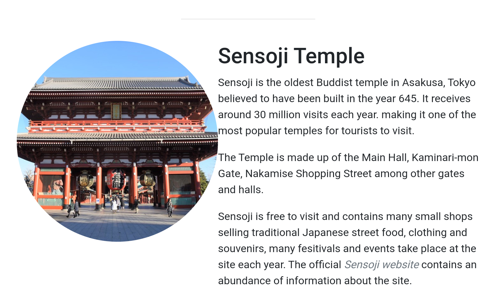
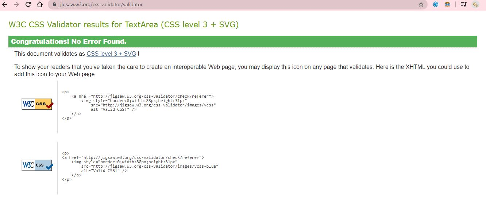
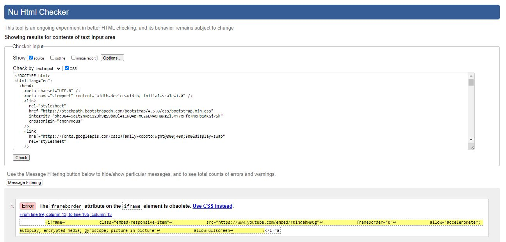

# Short Guide to Tokyo, Japan

For the project I decided to write a short and concise guide to some of the food and sites in Tokyo, based on my own trip to the city.  
 [Link to my deployed site with GitHub Pages](http://chloe-o.github.io/ms-project-one)

---

## UX

The website is aimed at those visiting Tokyo for a short amount of time and are particularly focused on some quintessential sites and foods.
I wanted the site to look light, clean and minimal to avoid a cluttered feeling when visiting. The site follows a rough colour scheme of white, blue and grey with circular images throughout the pages.

- For those looking for quick recommendations, it’s easy to find sites and foods listed on the site with quite concise descriptions
- I have included hyperlinks for some of the suggestions(opening in a new tab) so visitors can find out more information about a particular site or food if they wish without cluttering the site
- The navigation bar offers links to each page, this is present on each page for ease of navigation
- I have made use of ID’s on the Sites & Food pages so visitors can jump to a specific food or attraction without having to scroll, there are also ‘back to the top’ buttons at the bottom of these pages
- I have included a basic wireframe to show my idea for the site before building with ideas of a desktop and mobile view

## Technologies Used

Languages and framework used for this site:

- [JQuery](https://jquery.com/)  
  The project uses JQuery to simplify DOM manipulation

- [JavaScript](https://www.javascript.com/)  
  Used primarily for some of Bootstraps features

- [Bootstrap](https://getbootstrap.com/)  
  The project has been compiled with a mixture of CSS and Bootstrap framework

- HTML & CSS  
  Used for the basic structure of the site and some styling

---

## Testing

- When testing the site, I utilised Google’s Developer Tools and looked at the responsiveness of the site across many mobile device sizes within the tool, aspect of the content stack upon one another when on smallers screen sizes with the images on the index pages getting slightly smaller when on mobile devices
- I have tested the site using different browsers such as Google Chrome, Edge & Mozilla Firefox
- After deployment, I viewed the site on a Huawei P20 Pro, Samsung S8 & Samsung Tab 3

---

## Deployment

I deployed the site using GitHub pages, with help from [GitHub Pages's guide](https://pages.github.com/). I ran into a few issues whereby the CSS and images on the site did not work as they should. I got guidance from CodeInstitute's mentors who helped explain that all the file paths in my code were absolute so would not work with GitHub, I was able to quickly amend this and the CSS and images worked properly.

---

## Testing

- When testing the site, I utilised Google’s Developer Tools and looked at the responsiveness of the site across many mobile device sizes within the tool, aspect of the content stack upon one another when on smallers screen sizes with the images on the index pages getting slightly smaller when on mobile devices
- I have tested the site using different browsers such as Google Chrome, Edge & Mozilla Firefox
- After deployment, I viewed the site on a Huawei P20 Pro, Samsung S8 & Samsung Tab 3

- When testing the site on tablet sized devices, I found that on the sites & food pages, where the margin between the text & image should be there is no gap. I was unable to resolve this
- I ran the HTML & CSS for the site through respective validators, there were no issues with CSS

- However, when validating the HTML of the pages, I got the following errors:
  - The frameborder attribute on the iframe is obsolete. Use CSS instead > I did not alter this as had used Bootstrap's documentation for responsive videos, found [here](https://getbootstrap.com/docs/4.0/utilities/embed/)

---

## Media

- The photos used in this site were obtained from [Pixabay](https://pixabay.com/) and [Sora News 24](https://soranews24.com/) with any others being my own
- Photo of Mt Fuji on the index and sites pages as well as the Jumbotron image are my own

---

## Further Credit

- [Font Awesome](https://fontawesome.com/) for icons used on the site
- Photos of my own Mt. Fuji and Jumbotron Skyline photos
- [Japan-guide.com](https://www.japan-guide.com/) Site quoted on index page to include information about Tokyo as a city
- [W3 Schools](https://www.w3schools.com/) used for guidance when creating my contact form
- [Pixabay](https://pixabay.com/) - Used for photos included in the site
- [Sora News 24](https://soranews24.com/) - Used for photo of CoCo Curry
- [Bootstrap](https://getbootstrap.com/) - Used for general guidance when using classes and use of responsive iframe

---

## Acknowledgements

My inspiration for this project came from my own love of Japanese culture and food along with the desire to create a minimal and clean space to share this
